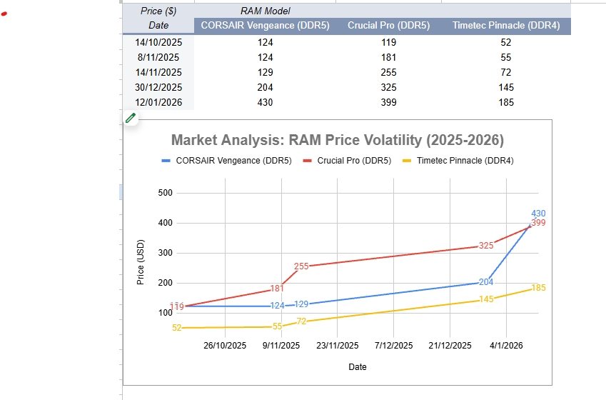
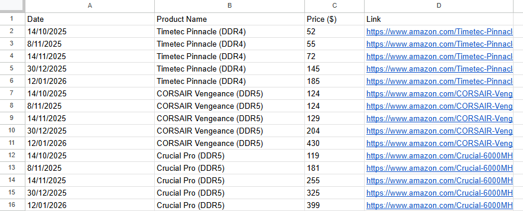
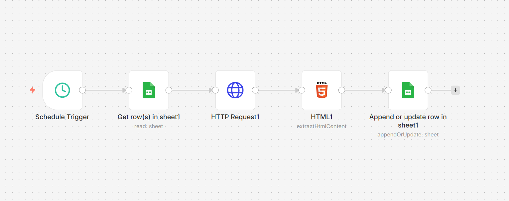

# Amazon-Price-Tracker
Automated ETL pipeline using n8n and Google Sheets to monitor and visualize Amazon RAM price volatility. Features real-time data scraping, automated cleaning, and interactive market trend analysis.

Project Title: Real-Time E-commerce Price Intelligence Pipeline
1. The Problem & Objective
The memory (RAM) market is known for high price volatility. Tracking these changes manually across multiple products is inefficient. Objective: Build an automated system to scrape, clean, and visualize price trends for high-performance RAM to identify market shifts and purchasing opportunities.

2. The Solution Architecture (The "How")
I designed a full ETL (Extract, Transform, Load) pipeline using the following stack:

Orchestration (n8n): Managed the entire workflow, from triggering the daily check to updating the final database.

Data Extraction (ScraperAPI): Bypassed anti-bot measures on Amazon to retrieve raw HTML content.

Data Transformation (JavaScript): Implemented custom logic in n8n to clean currency symbols, handle data types, and round prices to whole integers for cleaner analysis.

Data Warehousing & Visualization (Google Sheets): Used Pivot Tables to handle multi-product data streams and built an interactive dashboard.

3. Key Insights & Results
Based on the automated tracking of DDR4 vs. DDR5 modules:

Market Volatility: Identified a massive 244% price surge in DDR5 modules (Corsair Vengeance) between Q4 2025 and Q1 2026.

